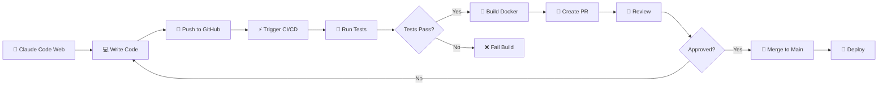

# 🚀 Claude Code Web + GitHub CI/CD Demo

A complete demonstration of using **Claude Code Web Version** (accessible from mobile devices) with GitHub Actions for automated CI/CD pipelines.

## 📱 Overview

This project showcases how to:
- Write code using Claude Code web version from your **phone or tablet**
- Push changes to GitHub in feature branches
- Automatically trigger **Docker builds**
- Run **automated tests**
- Create **Pull Requests automatically**
- Deploy to production when tests pass

## 🎯 The Complete Workflow



## 🌟 Key Features

### 1. Mobile-First Development
- Access Claude Code from any device with a web browser
- Write production code from your phone
- No local development environment needed
- Fix bugs from anywhere, anytime

### 2. Intelligent Error Handling 🆕
- **Auto-Issue Creation**: Failed builds automatically create detailed GitHub issues
- **Complete Debug Info**: Test logs, Docker logs, environment details
- **Claude-Friendly**: Issues formatted for easy Claude Code Web debugging
- **Auto-Close**: Issues automatically close when branch is merged
- **Smart Updates**: Subsequent failures update existing issues

### 3. Automated CI/CD Pipeline
- **Continuous Integration**: Automated tests on every push with caching
- **Docker Containerization**: Multi-stage builds with health checks
- **Automated PR Creation**: Feature branches automatically create PRs with commit history
- **Continuous Deployment**: Automatic deployment on main branch merge
- **Smart PR Updates**: Updates existing PRs instead of creating duplicates

### 4. Automatic Cleanup 🆕
- **Branch Deletion**: Feature branches deleted automatically after merge
- **Issue Closure**: Related failure issues closed when PR merges
- **Resource Management**: Artifacts with smart retention policies
- **Zero Manual Cleanup**: Fully automated branch lifecycle

### 5. Enhanced Visibility
- **Job Summaries**: Detailed summaries for each workflow run
- **Real-Time Logs**: Test and Docker logs uploaded as artifacts
- **Progress Tracking**: See exactly what's happening at each step
- **Error Highlighting**: Failed steps clearly marked with context

## 📋 Prerequisites

- GitHub account
- Claude Code Web access
- GitHub repository with Actions enabled

## 🚀 Getting Started

### Step 1: Setup Repository

1. **Fork or create this repository**

2. **Create the main branch** (IMPORTANT - do this first!)
   - If this is a new repository, you need to create a `main` branch first
   - You can do this by either:
     - Creating an initial commit and pushing to main, OR
     - Merging your first feature branch manually to create main
   - The automated PR creation will be skipped until main exists

3. **Enable GitHub Actions** in repository settings
   - Go to Settings > Actions > General
   - Allow all actions and reusable workflows

4. **Configure branch protection** (recommended)
   - Go to Settings > Branches
   - Add branch protection rule for `main`
   - Require pull request reviews before merging
   - Require status checks to pass before merging

### Step 2: Using Claude Code Web (From Your Phone!)

1. **Access Claude Code Web**
   - Open your mobile browser
   - Navigate to Claude Code web interface
   - Authenticate with your account

2. **Connect to GitHub**
   ```
   Tell Claude: "Clone my repository [repository-url]"
   ```

3. **Make Changes**
   ```
   Tell Claude: "Add a new feature to display user statistics"
   ```

4. **Push to Feature Branch**
   ```
   Tell Claude: "Push these changes to a new feature branch"
   ```

   Claude will automatically:
   - Create a branch with naming convention: `claude/feature-name-sessionid`
   - Commit your changes
   - Push to GitHub

### Step 3: Automated CI/CD Pipeline

Once you push to a `claude/*` branch, GitHub Actions automatically:

#### 🔨 Build Phase
```yaml
- Checkout code
- Install Node.js dependencies (with caching)
- Run automated tests
- Generate detailed test summaries
- Upload test logs as artifacts (7-day retention)
```

#### 🐳 Docker Phase
```yaml
- Build Docker image with multi-stage optimization
- Tag with commit SHA and latest
- Run container health checks
- Capture runtime logs
- Save image as artifact (1-day retention)
- Generate Docker build summaries
```

#### 📝 PR Phase (Automatic - Only on Success)
```yaml
- Check if main branch exists
- Gather commit history and summary
- Create or update Pull Request to main
- Add detailed PR description with:
  * Commit count and list
  * All CI/CD status checks
  * Automated checklist
- Label with 'automated-pr' and 'claude-code'
```

#### 🐛 Failure Handling (Automatic)
If any build or test fails:
```yaml
- Collect all test and Docker logs
- Gather system information
- Create detailed GitHub Issue with:
  * Failure type (test/docker)
  * Complete error logs
  * Environment details
  * Debugging tips for Claude Code Web
  * Direct link to failed workflow run
- Update existing issue if one exists for the branch
- Provide Claude-friendly debugging instructions
```

### Step 4: Error Recovery with Claude Code Web

**If the build fails**, you'll automatically get a GitHub issue with:

1. **Complete Error Logs**
   - Test output (last 3000 chars)
   - Docker build logs
   - Container runtime logs

2. **Debugging Context**
   - Exact commit and branch that failed
   - System environment details
   - Direct link to workflow run

3. **Claude-Ready Instructions**
   - Simply share the issue with Claude Code Web
   - Ask: "Review this CI failure and fix it"
   - Claude will analyze logs and make fixes
   - Push fixes to the same branch
   - CI runs automatically again

**Example workflow:**
```
❌ Build fails → 🐛 Issue created → 📱 Tell Claude to fix it →
✅ Claude pushes fix → 🔄 CI runs again → ✅ Success → 📝 PR created
```

### Step 5: Review and Merge

1. **Review the automated PR**
   - Check test results in PR summary
   - Review code changes
   - Verify Docker build succeeded
   - See commit list and count

2. **Merge when ready**
   - Click "Merge Pull Request"
   - Automatic deployment triggers
   - Branch cleanup happens automatically

3. **Automatic Cleanup**
   - Feature branch is deleted immediately
   - Related CI failure issues are closed
   - Cleanup summary is generated

4. **Deployment**
   - Application deploys to production
   - Health checks verify deployment
   - Deployment summary with details
   - All artifacts are available

## 🏗️ Project Structure

```
.
├── .github/
│   └── workflows/
│       └── ci-cd.yml          # GitHub Actions workflow
├── index.html                  # Main web page
├── server.js                   # Express server
├── test.js                     # Test suite
├── package.json                # Node.js dependencies
├── Dockerfile                  # Docker configuration
├── .dockerignore              # Docker ignore rules
├── .gitignore                 # Git ignore rules
└── README.md                  # This file
```

## 🔧 Configuration

### GitHub Actions Workflow

The `.github/workflows/ci-cd.yml` file defines a comprehensive CI/CD pipeline:

```yaml
# Triggers
on:
  push:
    branches:
      - 'claude/**'  # All Claude feature branches
      - main
  pull_request:
    branches:
      - main
  pull_request_target:
    types: [closed]  # For branch cleanup

# Jobs (6 total)
jobs:
  1. build-and-test:      # Run tests with detailed logging
     - Runs automated test suite
     - Generates test summaries
     - Uploads logs as artifacts
     - Continues on error for better reporting

  2. build-docker:        # Build and test container
     - Builds Docker image with multi-stage
     - Tags with commit SHA
     - Runs health checks
     - Captures runtime logs
     - Continues on error for better reporting

  3. create-debug-issue:  # Create issue on failure
     - Only runs if build-and-test or build-docker fails
     - Downloads all logs and artifacts
     - Collects system information
     - Creates detailed GitHub issue
     - Updates existing issue if present
     - Includes Claude-friendly debugging tips

  4. create-pr:           # Auto-create PR (on success)
     - Only runs if all tests pass
     - Checks if main branch exists
     - Gathers commit history
     - Creates or updates PR
     - Adds detailed description with commit list

  5. deploy:              # Deploy to production
     - Only runs on main branch pushes
     - Downloads Docker image
     - Generates deployment summary
     - Placeholder for deployment steps

  6. cleanup-branch:      # Clean up after merge
     - Only runs when PR is merged
     - Deletes feature branch automatically
     - Closes related CI failure issues
     - Generates cleanup summary
```

### Workflow Features

**Smart Error Handling:**
- Jobs use `continue-on-error` to capture logs even when failing
- All logs are uploaded as artifacts (7-day retention)
- Comprehensive debugging information in auto-created issues

**Efficient Resource Management:**
- NPM package caching for faster builds
- Docker artifacts with 1-day retention
- Test logs with 7-day retention
- Automatic branch cleanup after merge

**GitHub Integration:**
- Uses GitHub CLI (`gh`) for PR management
- Uses GitHub Script for advanced issue management
- Proper permissions for each job
- Conditional job execution based on context

### Environment Variables

Configure in GitHub repository settings under "Secrets and variables":

```
DOCKER_REGISTRY_URL    # Your Docker registry
DEPLOY_TOKEN          # Deployment token
SLACK_WEBHOOK         # Notifications (optional)
```

## 🧪 Testing

### Run Tests Locally

```bash
# Install dependencies
npm install

# Run tests
npm test

# Expected output:
# ✅ PASS: Health check endpoint returns 200
# ✅ PASS: Health check returns valid JSON
# ✅ PASS: API info endpoint returns 200
# ✅ PASS: API info returns valid structure
# ✅ PASS: Main page returns 200
```

### Run Docker Locally

```bash
# Build Docker image
docker build -t claude-cicd-demo .

# Run container
docker run -p 3000:3000 claude-cicd-demo

# Test health endpoint
curl http://localhost:3000/health

# Test application
open http://localhost:3000
```

## 📱 Mobile Workflow Example

Here's a real example of using Claude Code Web from your phone:

### Scenario: Add a New Feature

**You (via phone):**
> "Claude, I want to add a new section to the homepage that shows the current build number and deployment time"

**Claude responds:**
> "I'll add that feature for you. Let me update the index.html file..."

**You:**
> "Great! Now push this to GitHub"

**Claude responds:**
> "I'll commit these changes and push to a new feature branch..."
>
> ✅ Created branch: `claude/add-build-info-a1b2c3d4`
> ✅ Committed changes
> ✅ Pushed to GitHub
>
> The CI/CD pipeline is now running. You can monitor it at:
> https://github.com/your-username/repo/actions

### What Happens Next (Automatically)

**Success Path:**
1. **Within 30 seconds**: Tests start running
2. **Within 2 minutes**: Docker build completes
3. **Within 3 minutes**: PR is automatically created with commit history
4. **You receive**: GitHub notification on your phone
5. **You review**: PR from your phone browser with all details
6. **You approve**: Tap "Merge Pull Request"
7. **Within 1 minute**: Feature branch automatically deleted
8. **Within 5 minutes**: Feature is live in production!

**Failure Path:**
1. **Within 30 seconds**: Tests or Docker build fails
2. **Within 1 minute**: Detailed GitHub issue is created automatically
3. **You receive**: Issue notification with complete error logs
4. **You ask Claude**: "Review issue #X and fix the failures"
5. **Claude analyzes**: Reads logs, identifies problem, makes fixes
6. **Claude pushes**: Fix to the same branch
7. **Within 2 minutes**: CI runs again automatically
8. **On success**: Issue is updated, PR is created
9. **After merge**: Issue automatically closed, branch deleted

## 🎓 Use Cases

### 1. Quick Bug Fixes
Fix production issues from anywhere, anytime
```
"Claude, the health check endpoint is returning 404, can you fix it?"
```

### 2. Feature Development
Build new features without opening a laptop
```
"Claude, add a dark mode toggle to the website"
```

### 3. Code Reviews
Review and improve code quality
```
"Claude, refactor the server.js file to use async/await"
```

### 4. Documentation
Keep documentation up to date
```
"Claude, update the README with the new API endpoints"
```

## 🔐 Security Best Practices

1. **Branch Protection**
   - Require PR reviews before merging to main
   - Require status checks to pass
   - Restrict who can push to main

2. **Secrets Management**
   - Never commit secrets to repository
   - Use GitHub Secrets for sensitive data
   - Rotate credentials regularly

3. **Docker Security**
   - Use official base images
   - Scan images for vulnerabilities
   - Implement least privilege principle

## 🐛 Troubleshooting

### Automatic Issue Creation

**Good News!** When builds fail, the workflow automatically creates a detailed GitHub issue with:
- Complete error logs
- Environment information
- Direct links to failed workflow
- Claude-friendly debugging instructions

**To fix a failure:**
1. Check your GitHub Issues tab - there should be an auto-created issue
2. Open the issue and review the error logs
3. Tell Claude Code Web: "Review issue #X and fix the problems"
4. Claude will analyze the logs and push fixes
5. CI runs automatically on the same branch
6. When successful, the issue auto-closes

### Tests Failing

**Automatic:** Issue created with test logs

**Manual debugging:**
```bash
# Run locally to debug
npm install
npm test

# Check specific test
npm test -- --verbose
```

**Common fixes:**
- Update test assertions if business logic changed
- Check for missing dependencies
- Verify environment variables
- Review test timeout settings

### Docker Build Failing

**Automatic:** Issue created with Docker build logs

**Manual debugging:**
```bash
# Check Dockerfile syntax
docker build -t test .

# View detailed build logs
docker build --progress=plain -t test .

# Check for file access issues
ls -la
```

**Common fixes:**
- Verify Dockerfile syntax
- Check base image availability
- Ensure all files referenced exist
- Review .dockerignore file
- Check for network/registry issues

### PR Not Created Automatically

**Possible reasons:**

1. **Build failed** - Check for auto-created issue with details
2. **Main branch missing** - Workflow will skip PR creation with helpful message
3. **PR already exists** - Workflow updates existing PR instead
4. **Wrong branch name** - Must start with `claude/`

**Verification steps:**
```bash
# Check branch name
git branch

# Check workflow run
# Visit: https://github.com/your-username/repo/actions

# Check for existing PR
# Visit: https://github.com/your-username/repo/pulls
```

### Branch Not Deleted After Merge

**Automatic cleanup should happen when:**
- PR is merged (not closed)
- Branch name starts with `claude/`
- Workflow has proper permissions

**Manual cleanup if needed:**
```bash
# Delete local branch
git branch -d branch-name

# Delete remote branch
git push origin --delete branch-name
```

### Issue Not Auto-Closing After Merge

Issues are automatically closed when:
- Branch name in issue title matches merged branch
- Issue has `ci-failure` label
- PR was merged (not just closed)

Check issue labels and title if auto-close didn't work.

## 📊 Monitoring

### Workflow Summaries

Each workflow run generates detailed summaries visible in the GitHub Actions UI:

**Build & Test Summary:**
- ✅/❌ Test pass/fail status
- Last 50 lines of test output
- Quick identification of failures

**Docker Build Summary:**
- ✅/❌ Build status
- Image size information
- Container health check results
- Direct links to logs

**Deployment Summary:**
- Deployment timestamp
- Committed SHA
- Deployment target information

**Cleanup Summary:**
- Merged PR number
- Deleted branch name
- Related issues closed

### Build Status

Access comprehensive build information:

1. **GitHub Actions Tab**:
   - Real-time workflow progress
   - Build duration metrics
   - Test results
   - Job summaries

2. **Artifacts** (7-day retention):
   - Test logs
   - Docker build logs
   - Container runtime logs

3. **Auto-Created Issues** (on failure):
   - Complete error context
   - Environment details
   - Debugging suggestions

### Health Monitoring

```bash
# Check application health
curl https://your-app-url.com/health

# Check API status
curl https://your-app-url.com/api/info

# Expected response from health endpoint:
# {"status":"healthy","timestamp":"2024-01-01T00:00:00.000Z"}
```

## 🚀 Deployment Options

This setup can deploy to:

- **Cloud Platforms**: AWS, GCP, Azure
- **Container Orchestration**: Kubernetes, Docker Swarm
- **PaaS**: Heroku, Render, Railway
- **Serverless**: AWS Lambda, Google Cloud Functions
- **Edge**: Cloudflare Workers, Vercel

To configure deployment, update the `deploy` job in `.github/workflows/ci-cd.yml`

## 🤝 Contributing

This is a demo project, but contributions are welcome!

1. Use Claude Code Web to make changes
2. Push to a feature branch
3. Wait for automated PR creation
4. Review and merge

## 📝 License

MIT License - feel free to use this for your own projects!

## 🎉 Success Metrics

With this setup, you can:
- ✅ Write code from your phone
- ✅ Deploy to production in under 5 minutes
- ✅ Automatically run tests on every change
- ✅ Ensure code quality with automated checks
- ✅ Work from anywhere, anytime

## 🔗 Resources

- [GitHub Actions Documentation](https://docs.github.com/en/actions)
- [Docker Documentation](https://docs.docker.com/)
- [Claude Code Documentation](https://docs.anthropic.com/claude/docs)
- [Express.js Documentation](https://expressjs.com/)

## 💡 Tips for Mobile Development

1. **Use Voice Input**: Most mobile browsers support voice-to-text
2. **Bookmark Repository**: Quick access to your GitHub repo
3. **Enable Notifications**: Stay updated on PR status
4. **Use Split Screen**: View docs while coding with Claude
5. **Test on Device**: Mobile-first approach ensures compatibility

## 🎯 Next Steps

1. **Customize the Pipeline**: Add more tests, linting, security scans
2. **Add Monitoring**: Integrate with monitoring services
3. **Implement Staging**: Add a staging environment
4. **Add Notifications**: Slack, Discord, or email notifications
5. **Scale Up**: Add load balancing and auto-scaling

---

**Happy coding from your phone! 📱 + 🚀 = 💯**

Built with ❤️ using Claude Code Web
