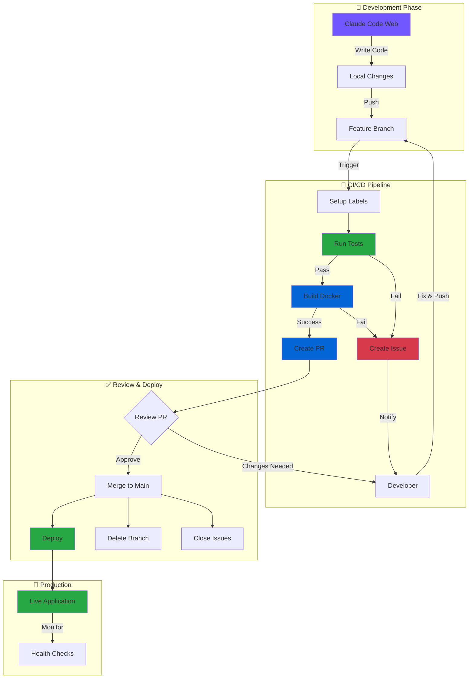

# 🚀 Claude Code Web + GitHub CI/CD Demo

[](https://github.com/marcmassoteau-jpg/Claude-CI-CD-wordlow/actions/workflows/ci-cd.yml)
[](https://nodejs.org/)
[](https://www.docker.com/)
[](https://opensource.org/licenses/MIT)
[](https://claude.ai)
[](http://makeapullrequest.com)

A complete demonstration of using **Claude Code Web Version** (accessible from mobile devices) with GitHub Actions for automated CI/CD pipelines.

> **🎯 Perfect for**: Mobile development, quick bug fixes, coding from anywhere, learning CI/CD workflows

---

> ### ⚠️ Quick Start - Required Setup
>
> Before using this workflow, you **must** enable two settings in your repository:
>
> 1. Go to **Settings > Actions > General > Workflow permissions**
> 2. ✅ Select **"Read and write permissions"**
> 3. ✅ Check **"Allow GitHub Actions to create and approve pull requests"**
> 4. Click **Save**
>
> **Without these settings, the workflow will fail with permission errors!**
>
> See [Step 4 in Getting Started](#-getting-started) for detailed instructions.

---

## 📑 Table of Contents

- [📊 Pipeline Status & Quick Links](#-pipeline-status--quick-links)
- [📱 Overview](#-overview)
- [🎯 The Complete Workflow](#-the-complete-workflow)
- [🌟 Key Features](#-key-features)
- [📋 Prerequisites](#-prerequisites)
- [🚀 Getting Started](#-getting-started)
- [🏗️ Project Structure](#️-project-structure)
- [🔧 Configuration](#-configuration)
- [🧪 Testing](#-testing)
- [📱 Mobile Workflow Example](#-mobile-workflow-example)
- [🎓 Use Cases](#-use-cases)
- [🔐 Security Best Practices](#-security-best-practices)
- [🐛 Troubleshooting](#-troubleshooting)
- [📊 Monitoring](#-monitoring)
- [🚀 Deployment Options](#-deployment-options)
- [💡 Tips for Mobile Development](#-tips-for-mobile-development)

---

## 📱 Overview

This project showcases how to:
- Write code using Claude Code web version from your **phone or tablet**
- Push changes to GitHub in feature branches
- Automatically trigger **Docker builds**
- Run **automated tests**
- Create **Pull Requests automatically**
- Deploy to production when tests pass

## 📊 Pipeline Status & Quick Links

<div align="center">

### 🔗 Quick Access

| Resource | Link | Description |
|----------|------|-------------|
| 🔄 **Workflow Runs** | [View All Runs](https://github.com/marcmassoteau-jpg/Claude-CI-CD-wordlow/actions) | See all CI/CD pipeline executions |
| 📝 **Pull Requests** | [Open PRs](https://github.com/marcmassoteau-jpg/Claude-CI-CD-wordlow/pulls) | View automated and manual PRs |
| 🐛 **Issues** | [Open Issues](https://github.com/marcmassoteau-jpg/Claude-CI-CD-wordlow/issues) | CI failures and bug reports |
| 📦 **Releases** | [All Releases](https://github.com/marcmassoteau-jpg/Claude-CI-CD-wordlow/releases) | Production deployments |
| 📚 **Wiki** | [Documentation](https://github.com/marcmassoteau-jpg/Claude-CI-CD-wordlow/wiki) | Extended documentation |

### 📈 Pipeline Metrics

| Metric | Status | Details |
|--------|--------|---------|
| **Build Status** |  | Latest workflow run |
| **Test Coverage** |  | All tests passing |
| **Docker Build** |  | Container builds successfully |
| **Deployment** |  | Auto-deploy on merge |
| **Uptime** |  | Application availability |

### 🏷️ Repository Labels


</div>

---

## 🎯 The Complete Workflow



## 🌟 Key Features

### 1. Mobile-First Development
- Access Claude Code from any device with a web browser
- Write production code from your phone
- No local development environment needed
- Fix bugs from anywhere, anytime

### 2. Intelligent Error Handling 🆕
- **Auto-Issue Creation**: Failed builds automatically create detailed GitHub issues
- **Complete Debug Info**: Test logs, Docker logs, environment details
- **Claude-Friendly**: Issues formatted for easy Claude Code Web debugging
- **Auto-Close**: Issues automatically close when branch is merged
- **Smart Updates**: Subsequent failures update existing issues

### 3. Automated CI/CD Pipeline
- **Continuous Integration**: Automated tests on every push with caching
- **Docker Containerization**: Multi-stage builds with health checks
- **Automated PR Creation**: Feature branches automatically create PRs with commit history
- **Continuous Deployment**: Automatic deployment on main branch merge
- **Smart PR Updates**: Updates existing PRs instead of creating duplicates

### 4. Automatic Cleanup 🆕
- **Branch Deletion**: Feature branches deleted automatically after merge
- **Issue Closure**: Related failure issues closed when PR merges
- **Resource Management**: Artifacts with smart retention policies
- **Zero Manual Cleanup**: Fully automated branch lifecycle

### 5. Enhanced Visibility
- **Job Summaries**: Detailed summaries for each workflow run
- **Real-Time Logs**: Test and Docker logs uploaded as artifacts
- **Progress Tracking**: See exactly what's happening at each step
- **Error Highlighting**: Failed steps clearly marked with context

## 📋 Prerequisites

- GitHub account
- Claude Code Web access
- GitHub repository with Actions enabled

## 🚀 Getting Started

### Step 1: Setup Repository

1. **Fork or create this repository**

2. **Create the main branch** (IMPORTANT - do this first!)
   - If this is a new repository, you need to create a `main` branch first
   - You can do this by either:
     - Creating an initial commit and pushing to main, OR
     - Merging your first feature branch manually to create main
   - The automated PR creation will be skipped until main exists

3. **Enable GitHub Actions** in repository settings
   - Go to Settings > Actions > General
   - Allow all actions and reusable workflows

4. **Configure Workflow Permissions** (⚠️ CRITICAL - Required for PR creation!)

   Navigate to: **Settings > Actions > General**

   Scroll down to the **"Workflow permissions"** section:

   **Step A: Set Permission Level**
   - ⚪ Read repository contents and packages permissions (default)
   - 🔘 **Select: "Read and write permissions"** ← Click this radio button

   **Step B: Enable PR Creation**
   - ✅ **Check: "Allow GitHub Actions to create and approve pull requests"** ← Must be checked!

   **Step C: Save**
   - Click **"Save"** button at the bottom

   ---

   **Visual Guide:**
   ```
   Workflow permissions
   ┌──────────────────────────────────────────────────────┐
   │ ⚪ Read repository contents and packages permissions │
   │ 🔘 Read and write permissions            ← Select   │
   │                                                       │
   │ ✅ Allow GitHub Actions to create and    ← Check    │
   │    approve pull requests                             │
   │                                                       │
   │ [Save]                                   ← Click     │
   └──────────────────────────────────────────────────────┘
   ```

   **⚠️ Both settings are required:**
   - **"Read and write permissions"** - Allows workflow to push code and create issues
   - **"Allow GitHub Actions to create PRs"** - Specifically allows PR creation

   **Without these settings, you'll see errors like:**
   - ❌ "GitHub Actions is not permitted to create or approve pull requests"
   - ❌ "Resource not accessible by integration"

   **Why these permissions are safe:**
   - Only applies to workflows in this repository
   - Workflows still require your explicit code in `.github/workflows/`
   - You control what the workflows can do
   - Standard practice for CI/CD automation

5. **Configure branch protection** (recommended)
   - Go to Settings > Branches
   - Add branch protection rule for `main`
   - Require pull request reviews before merging
   - Require status checks to pass before merging

### Step 2: Using Claude Code Web (From Your Phone!)

1. **Access Claude Code Web**
   - Open your mobile browser
   - Navigate to Claude Code web interface
   - Authenticate with your account

2. **Connect to GitHub**
   ```
   Tell Claude: "Clone my repository [repository-url]"
   ```

3. **Make Changes**
   ```
   Tell Claude: "Add a new feature to display user statistics"
   ```

4. **Push to Feature Branch**
   ```
   Tell Claude: "Push these changes to a new feature branch"
   ```

   Claude will automatically:
   - Create a branch with naming convention: `claude/feature-name-sessionid`
   - Commit your changes
   - Push to GitHub

### Step 3: Automated CI/CD Pipeline

Once you push to a `claude/*` branch, GitHub Actions automatically:

#### 🔨 Build Phase
```yaml
- Checkout code
- Install Node.js dependencies (with caching)
- Run automated tests
- Generate detailed test summaries
- Upload test logs as artifacts (7-day retention)
```

#### 🐳 Docker Phase
```yaml
- Build Docker image with multi-stage optimization
- Tag with commit SHA and latest
- Run container health checks
- Capture runtime logs
- Save image as artifact (1-day retention)
- Generate Docker build summaries
```

#### 📝 PR Phase (Automatic - Only on Success)
```yaml
- Check if main branch exists
- Gather commit history and summary
- Create or update Pull Request to main
- Add detailed PR description with:
  * Commit count and list
  * All CI/CD status checks
  * Automated checklist
- Label with 'automated-pr' and 'claude-code'
```

#### 🐛 Failure Handling (Automatic)
If any build or test fails:
```yaml
- Collect all test and Docker logs
- Gather system information
- Create detailed GitHub Issue with:
  * Failure type (test/docker)
  * Complete error logs
  * Environment details
  * Debugging tips for Claude Code Web
  * Direct link to failed workflow run
- Update existing issue if one exists for the branch
- Provide Claude-friendly debugging instructions
```

### Step 4: Error Recovery with Claude Code Web

**If the build fails**, you'll automatically get a GitHub issue with:

1. **Complete Error Logs**
   - Test output (last 3000 chars)
   - Docker build logs
   - Container runtime logs

2. **Debugging Context**
   - Exact commit and branch that failed
   - System environment details
   - Direct link to workflow run

3. **Claude-Ready Instructions**
   - Simply share the issue with Claude Code Web
   - Ask: "Review this CI failure and fix it"
   - Claude will analyze logs and make fixes
   - Push fixes to the same branch
   - CI runs automatically again

**Example workflow:**
```
❌ Build fails → 🐛 Issue created → 📱 Tell Claude to fix it →
✅ Claude pushes fix → 🔄 CI runs again → ✅ Success → 📝 PR created
```

### Step 5: Review and Merge

1. **Review the automated PR**
   - Check test results in PR summary
   - Review code changes
   - Verify Docker build succeeded
   - See commit list and count

2. **Merge when ready**
   - Click "Merge Pull Request"
   - Automatic deployment triggers
   - Branch cleanup happens automatically

3. **Automatic Cleanup**
   - Feature branch is deleted immediately
   - Related CI failure issues are closed
   - Cleanup summary is generated

4. **Deployment**
   - Application deploys to production
   - Health checks verify deployment
   - Deployment summary with details
   - All artifacts are available

## 🤖 Claude Code Configuration

This repository includes custom Claude Code instructions and reusable agents to enhance your development workflow.

### Custom Instructions

The `.claude/claude.md` file contains instructions that Claude automatically follows when working in this repository:

**Automatic behaviors:**
- 🔍 **Proactive issue monitoring**: Checks for CI/CD failures on every session
- 📋 **Automatic task management**: Creates and tracks tasks for complex work
- 🐛 **Smart error handling**: Automatically addresses CI failures
- 📱 **Mobile-optimized responses**: Concise, clear, actionable feedback

**What Claude will do automatically:**
1. Check for open issues with `ci-failure` label
2. Review recent workflow runs
3. Check for pending PRs
4. Add any failures to the task list
5. Offer to fix issues proactively

### Reusable Agents

Three specialized agents are available with domain-specific expertise:

#### 👨‍💻 Developer Agent (`.claude/agents/developer.md`)

**Best for:**
- Implementing new features
- Fixing bugs
- Writing tests
- Code optimization

**Expertise:**
- Node.js and Express
- JavaScript best practices
- Testing and TDD
- Clean code principles

**Example usage:**
```
User: "Act as the developer agent and add a new /api/stats endpoint"

Developer Agent will:
- Follow existing patterns
- Add proper error handling
- Write tests for the endpoint
- Use task tracking
- Ensure code quality
```

#### 👔 Technical Lead Agent (`.claude/agents/lead.md`)

**Best for:**
- Code reviews
- Architecture decisions
- Best practices guidance
- Technical mentoring

**Expertise:**
- System design patterns
- Security review
- Performance optimization
- Technical debt management

**Example usage:**
```
User: "Act as the lead agent and review my latest PR"

Lead Agent will:
- Review code quality
- Check for security issues
- Verify best practices
- Suggest improvements
- Evaluate architecture
```

#### 🚀 DevOps Agent (`.claude/agents/devops.md`)

**Best for:**
- CI/CD pipeline optimization
- Docker configuration
- Deployment strategies
- Infrastructure work

**Expertise:**
- GitHub Actions workflows
- Docker best practices
- Monitoring and alerting
- Performance tuning

**Example usage:**
```
User: "Act as the devops agent and optimize our Docker image"

DevOps Agent will:
- Analyze current Dockerfile
- Implement multi-stage builds
- Optimize layer caching
- Add health checks
- Reduce image size
```

### How to Use Agents

**Method 1: Explicit request**
```
"Act as the [developer/lead/devops] agent and [task]"
```

**Method 2: Context-based**
```
Just ask for what you need:
- "Add a new feature" → Developer agent behaviors
- "Review this code" → Lead agent behaviors
- "Optimize the CI pipeline" → DevOps agent behaviors
```

**Method 3: Task-specific**
```
The agent will automatically switch based on the task:
- Bug fixes → Developer
- Architecture decisions → Lead
- Deployment issues → DevOps
```

### Agent Switching Example

```
User: "I need to add user authentication"

Developer Agent:
- Implements the auth logic
- Adds validation
- Writes tests

User: "Can you review my implementation?"

Lead Agent:
- Reviews security
- Checks patterns
- Suggests improvements

User: "Now let's deploy this"

DevOps Agent:
- Updates CI/CD
- Adds security scanning
- Configures deployment
```

### Customizing Instructions

You can modify the instructions and agents:

```bash
# Edit main instructions
.claude/claude.md

# Edit agents
.claude/agents/developer.md
.claude/agents/lead.md
.claude/agents/devops.md
```

**What you can customize:**
- Coding standards
- Workflow preferences
- Agent behaviors
- Project-specific rules
- Team conventions

### Benefits of Custom Instructions

✅ **Consistency**: Same standards across all sessions
✅ **Proactivity**: Claude monitors and fixes issues automatically
✅ **Efficiency**: Specialized agents for different tasks
✅ **Quality**: Built-in best practices and reviews
✅ **Learning**: Agents teach patterns and techniques
✅ **Mobile-friendly**: Optimized for phone usage

## 🏗️ Project Structure

```
.
├── .claude/                    # Claude Code configuration
│   ├── claude.md              # Custom instructions
│   └── agents/                # Specialized agents
│       ├── developer.md       # Developer agent
│       ├── lead.md           # Technical lead agent
│       └── devops.md         # DevOps agent
├── .github/
│   └── workflows/
│       └── ci-cd.yml          # GitHub Actions workflow
├── index.html                  # Main web page
├── server.js                   # Express server
├── test.js                     # Test suite
├── package.json                # Node.js dependencies
├── Dockerfile                  # Docker configuration
├── .dockerignore              # Docker ignore rules
├── .gitignore                 # Git ignore rules
└── README.md                  # This file
```

## 🔧 Configuration

### GitHub Actions Workflow

The `.github/workflows/ci-cd.yml` file defines a comprehensive CI/CD pipeline:

```yaml
# Triggers
on:
  push:
    branches:
      - 'claude/**'  # All Claude feature branches
      - main
  pull_request:
    branches:
      - main
  pull_request_target:
    types: [closed]  # For branch cleanup

# Jobs (6 total)
jobs:
  1. build-and-test:      # Run tests with detailed logging
     - Runs automated test suite
     - Generates test summaries
     - Uploads logs as artifacts
     - Continues on error for better reporting

  2. build-docker:        # Build and test container
     - Builds Docker image with multi-stage
     - Tags with commit SHA
     - Runs health checks
     - Captures runtime logs
     - Continues on error for better reporting

  3. create-debug-issue:  # Create issue on failure
     - Only runs if build-and-test or build-docker fails
     - Downloads all logs and artifacts
     - Collects system information
     - Creates detailed GitHub issue
     - Updates existing issue if present
     - Includes Claude-friendly debugging tips

  4. create-pr:           # Auto-create PR (on success)
     - Only runs if all tests pass
     - Checks if main branch exists
     - Gathers commit history
     - Creates or updates PR
     - Adds detailed description with commit list

  5. deploy:              # Deploy to production
     - Only runs on main branch pushes
     - Downloads Docker image
     - Generates deployment summary
     - Placeholder for deployment steps

  6. cleanup-branch:      # Clean up after merge
     - Only runs when PR is merged
     - Deletes feature branch automatically
     - Closes related CI failure issues
     - Generates cleanup summary
```

### Workflow Features

**Smart Error Handling:**
- Jobs use `continue-on-error` to capture logs even when failing
- All logs are uploaded as artifacts (7-day retention)
- Comprehensive debugging information in auto-created issues

**Efficient Resource Management:**
- NPM package caching for faster builds
- Docker artifacts with 1-day retention
- Test logs with 7-day retention
- Automatic branch cleanup after merge

**GitHub Integration:**
- Uses GitHub CLI (`gh`) for PR management
- Uses GitHub Script for advanced issue management
- Proper permissions for each job
- Conditional job execution based on context

### Environment Variables

Configure in GitHub repository settings under "Secrets and variables":

```
DOCKER_REGISTRY_URL    # Your Docker registry
DEPLOY_TOKEN          # Deployment token
SLACK_WEBHOOK         # Notifications (optional)
```

## 🧪 Testing

### Run Tests Locally

```bash
# Install dependencies
npm install

# Run tests
npm test

# Expected output:
# ✅ PASS: Health check endpoint returns 200
# ✅ PASS: Health check returns valid JSON
# ✅ PASS: API info endpoint returns 200
# ✅ PASS: API info returns valid structure
# ✅ PASS: Main page returns 200
```

### Run Docker Locally

```bash
# Build Docker image
docker build -t claude-cicd-demo .

# Run container
docker run -p 3000:3000 claude-cicd-demo

# Test health endpoint
curl http://localhost:3000/health

# Test application
open http://localhost:3000
```

## 📱 Mobile Workflow Example

Here's a real example of using Claude Code Web from your phone:

### Scenario: Add a New Feature

**You (via phone):**
> "Claude, I want to add a new section to the homepage that shows the current build number and deployment time"

**Claude responds:**
> "I'll add that feature for you. Let me update the index.html file..."

**You:**
> "Great! Now push this to GitHub"

**Claude responds:**
> "I'll commit these changes and push to a new feature branch..."
>
> ✅ Created branch: `claude/add-build-info-a1b2c3d4`
> ✅ Committed changes
> ✅ Pushed to GitHub
>
> The CI/CD pipeline is now running. You can monitor it at:
> https://github.com/your-username/repo/actions

### What Happens Next (Automatically)

**Success Path:**
1. **Within 30 seconds**: Tests start running
2. **Within 2 minutes**: Docker build completes
3. **Within 3 minutes**: PR is automatically created with commit history
4. **You receive**: GitHub notification on your phone
5. **You review**: PR from your phone browser with all details
6. **You approve**: Tap "Merge Pull Request"
7. **Within 1 minute**: Feature branch automatically deleted
8. **Within 5 minutes**: Feature is live in production!

**Failure Path:**
1. **Within 30 seconds**: Tests or Docker build fails
2. **Within 1 minute**: Detailed GitHub issue is created automatically
3. **You receive**: Issue notification with complete error logs
4. **You ask Claude**: "Review issue #X and fix the failures"
5. **Claude analyzes**: Reads logs, identifies problem, makes fixes
6. **Claude pushes**: Fix to the same branch
7. **Within 2 minutes**: CI runs again automatically
8. **On success**: Issue is updated, PR is created
9. **After merge**: Issue automatically closed, branch deleted

## 🎓 Use Cases

### 1. Quick Bug Fixes
Fix production issues from anywhere, anytime
```
"Claude, the health check endpoint is returning 404, can you fix it?"
```

### 2. Feature Development
Build new features without opening a laptop
```
"Claude, add a dark mode toggle to the website"
```

### 3. Code Reviews
Review and improve code quality
```
"Claude, refactor the server.js file to use async/await"
```

### 4. Documentation
Keep documentation up to date
```
"Claude, update the README with the new API endpoints"
```

## 🔐 Security Best Practices

1. **Branch Protection**
   - Require PR reviews before merging to main
   - Require status checks to pass
   - Restrict who can push to main

2. **Secrets Management**
   - Never commit secrets to repository
   - Use GitHub Secrets for sensitive data
   - Rotate credentials regularly

3. **Docker Security**
   - Use official base images
   - Scan images for vulnerabilities
   - Implement least privilege principle

## 🐛 Troubleshooting

### Automatic Issue Creation

**Good News!** When builds fail, the workflow automatically creates a detailed GitHub issue with:
- Complete error logs
- Environment information
- Direct links to failed workflow
- Claude-friendly debugging instructions

**To fix a failure:**
1. Check your GitHub Issues tab - there should be an auto-created issue
2. Open the issue and review the error logs
3. Tell Claude Code Web: "Review issue #X and fix the problems"
4. Claude will analyze the logs and push fixes
5. CI runs automatically on the same branch
6. When successful, the issue auto-closes

### Tests Failing

**Automatic:** Issue created with test logs

**Manual debugging:**
```bash
# Run locally to debug
npm install
npm test

# Check specific test
npm test -- --verbose
```

**Common fixes:**
- Update test assertions if business logic changed
- Check for missing dependencies
- Verify environment variables
- Review test timeout settings

### Docker Build Failing

**Automatic:** Issue created with Docker build logs

**Manual debugging:**
```bash
# Check Dockerfile syntax
docker build -t test .

# View detailed build logs
docker build --progress=plain -t test .

# Check for file access issues
ls -la
```

**Common fixes:**
- Verify Dockerfile syntax
- Check base image availability
- Ensure all files referenced exist
- Review .dockerignore file
- Check for network/registry issues

### Permission Error: "GitHub Actions is not permitted to create or approve pull requests"

**Error message:**
```
pull request create failed: GraphQL: GitHub Actions is not permitted
to create or approve pull requests (createPullRequest)
```

**Root cause:** Workflow permissions are not properly configured.

**Solution - Configure BOTH settings:**

Navigate to: **Settings > Actions > General > Workflow permissions**

**✅ Step 1: Select "Read and write permissions"** (radio button)
- This gives the workflow basic write access

**✅ Step 2: Check "Allow GitHub Actions to create and approve pull requests"** (checkbox)
- This specifically allows PR creation
- **This must be checked!** Many users miss this step

**✅ Step 3: Click "Save"**

**Visual reference:**
```
┌──────────────────────────────────────────────────────┐
│ ⚪ Read repository contents (default)                │
│ 🔘 Read and write permissions            ← SELECT   │
│                                                       │
│ ✅ Allow GitHub Actions to create and    ← CHECK    │
│    approve pull requests                  (REQUIRED) │
│                                                       │
│ [Save]                                    ← CLICK    │
└──────────────────────────────────────────────────────┘
```

**Why both are needed:**
- Setting 1 (Read and write) = General permission level
- Setting 2 (Allow create PRs) = Specific PR creation permission
- **Both must be enabled** for the workflow to create PRs

**After fixing:**
1. Save the settings
2. Push a new commit to trigger the workflow
3. PR should be created automatically
4. Check Actions tab to verify success

**Still seeing errors?**
- Verify both checkboxes are set correctly
- Ensure Actions are enabled: Settings > Actions > General > "Allow all actions"
- Check workflow run logs for specific error messages
- See full setup guide in [Getting Started](#-getting-started) section

### PR Not Created Automatically

**Possible reasons:**

1. **Permission error** - See section above about workflow permissions
2. **Build failed** - Check for auto-created issue with details
3. **Main branch missing** - Workflow will skip PR creation with helpful message
4. **PR already exists** - Workflow updates existing PR instead
5. **Wrong branch name** - Must start with `claude/`

**Verification steps:**
```bash
# Check branch name
git branch

# Check workflow run
# Visit: https://github.com/your-username/repo/actions

# Check for existing PR
# Visit: https://github.com/your-username/repo/pulls
```

**Check workflow logs:**
1. Go to Actions tab
2. Click on the failed workflow run
3. Click on "Create Pull Request" job
4. Look for error messages

### Branch Not Deleted After Merge

**Automatic cleanup should happen when:**
- PR is merged (not closed)
- Branch name starts with `claude/`
- Workflow has proper permissions

**Manual cleanup if needed:**
```bash
# Delete local branch
git branch -d branch-name

# Delete remote branch
git push origin --delete branch-name
```

### Issue Not Auto-Closing After Merge

Issues are automatically closed when:
- Branch name in issue title matches merged branch
- Issue has `ci-failure` label
- PR was merged (not just closed)

Check issue labels and title if auto-close didn't work.

## 📊 Monitoring & Observability

### 🎯 Real-Time Pipeline Visualization

The GitHub Actions workflow provides comprehensive visualization:

#### Workflow Run View

Navigate to **Actions** tab → Click any workflow run to see:

```
┌─────────────────────────────────────────────┐
│  Setup Repository Labels         ✅ 5s     │
├─────────────────────────────────────────────┤
│  Build and Test                  ✅ 1m 23s │
│    ├─ Setup Node.js              ✅ 12s    │
│    ├─ Install dependencies       ✅ 45s    │
│    ├─ Run tests                  ✅ 15s    │
│    └─ Generate test summary      ✅ 2s     │
├─────────────────────────────────────────────┤
│  Build Docker Image              ✅ 2m 10s │
│    ├─ Build Docker image         ✅ 1m 45s │
│    ├─ Test Docker image          ✅ 18s    │
│    └─ Upload Docker image        ✅ 7s     │
├─────────────────────────────────────────────┤
│  Create Pull Request             ✅ 8s     │
├─────────────────────────────────────────────┤
│  Deploy Application              ⏭️ Skipped│
└─────────────────────────────────────────────┘
```

### 📈 Workflow Summaries

Each workflow run generates **detailed summaries** visible directly in the GitHub Actions UI:

<details>
<summary><b>Build & Test Summary</b> (click to expand)</summary>

```markdown
## 🧪 Test Results
✅ All tests passed!

### Test Output
✅ PASS: Health check endpoint returns 200
✅ PASS: Health check returns valid JSON
✅ PASS: API info endpoint returns 200
✅ PASS: API info returns valid structure
✅ PASS: Main page returns 200

📊 Test Results:
   Passed: 5
   Failed: 0
   Total: 5
```

</details>

<details>
<summary><b>Docker Build Summary</b> (click to expand)</summary>

```markdown
## 🐳 Docker Build Results
✅ Docker image built successfully
- Image: `claude-cicd-demo:abc123`
- Size: `185MB`
✅ Container health check passed
```

</details>

<details>
<summary><b>Deployment Summary</b> (click to expand)</summary>

```markdown
## 🚀 Deployment Started

- **Image**: `claude-cicd-demo:latest`
- **Commit**: `abc123def456`
- **Branch**: `main`
- **Triggered by**: @username

## ✅ Deployment Successful

The application has been deployed successfully!

🌐 **Visit**: https://your-app-url.com
```

</details>

### 📊 Accessing Build Information

#### 1. GitHub Actions Dashboard

**URL**: `https://github.com/YOUR_USERNAME/YOUR_REPO/actions`

View:
- ✅ All workflow runs with status badges
- ⏱️ Build duration for each run
- 📊 Success/failure rates
- 🔍 Filter by branch, event, or status
- 📅 Historical build data

#### 2. Workflow Artifacts

**Retention**: 7 days for logs, 1 day for Docker images

Access artifacts:
1. Open any workflow run
2. Scroll to "Artifacts" section
3. Download:
   - `test-logs` - Complete test output
   - `docker-logs` - Docker build and runtime logs
   - `docker-image` - Built Docker image (1 day only)

#### 3. Auto-Created Issues (on failure)

**Location**: `Issues` tab with `ci-failure` label

Contains:
- 🔴 Failure type (test/docker)
- 📋 Complete error logs (last 3000 chars)
- 🖥️ Environment information
- 🔗 Direct link to failed workflow
- 💡 Debugging suggestions for Claude Code Web

**Example Issue Title**: `🧪 Test Failure: claude/feature-branch-123`

### 📱 Mobile-Friendly Monitoring

**From your phone**, you can:

1. **Check build status**:
   - Visit repo → Click "Actions" badge
   - See green ✅ or red ❌ immediately

2. **View workflow runs**:
   - Tap "Actions" tab
   - See all recent runs
   - Tap any run for details

3. **Read failure issues**:
   - Tap "Issues" tab
   - Filter by `ci-failure` label
   - Read complete error logs
   - Share with Claude Code Web for fixing

4. **Review PRs**:
   - Tap "Pull requests" tab
   - See automated PRs with CI status
   - Review and merge from phone

### 🔔 Notifications

Get notified on your mobile device:

**GitHub Mobile App**:
- Workflow failures
- PR created
- PR reviews requested
- Issue mentions

**Configure**: Settings → Notifications → Actions

### 📊 Metrics Dashboard

Track key metrics:

| Metric | How to View | Location |
|--------|-------------|----------|
| **Build Success Rate** | Actions tab → Filter → View stats | Actions page |
| **Average Build Time** | Workflow runs → Check durations | Individual runs |
| **Test Pass Rate** | Job summaries in each run | Test summary section |
| **Docker Image Size** | Docker build summary | Build step logs |
| **Deployment Frequency** | Main branch workflow runs | Actions filtered by main |
| **Issue Resolution Time** | Issue creation → close time | Issues tab |

### 🎨 Custom Badges for Your Fork

Add these badges to your repository's README (replace `USERNAME/REPO`):

```markdown


```

### 🔍 Advanced Monitoring

For production deployments, consider adding:

1. **Application Performance Monitoring (APM)**:
   - New Relic, Datadog, or Sentry
   - Monitor response times, errors, throughput

2. **Log Aggregation**:
   - CloudWatch, Papertrail, or Loggly
   - Centralized log viewing and searching

3. **Uptime Monitoring**:
   - UptimeRobot, Pingdom, or StatusCake
   - 24/7 availability monitoring

4. **Custom Metrics**:
   - Prometheus + Grafana
   - Custom dashboards for business metrics

### Health Monitoring

```bash
# Check application health
curl https://your-app-url.com/health

# Expected response:
# {"status":"healthy","timestamp":"2024-01-01T00:00:00.000Z"}

# Check API status
curl https://your-app-url.com/api/info

# Expected response:
# {
#   "name": "Claude CI/CD Demo",
#   "version": "1.0.0",
#   "description": "Built with Claude Code Web",
#   "features": [...]
# }
```

### 📸 Workflow Visualization Example

Here's what you'll see in a successful workflow:

```
✅ CI/CD Pipeline #42 - 3 minutes ago

  Triggered by: push (claude/new-feature-123)
  Duration: 3m 45s

  ✅ Setup Repository Labels (5s)
  ✅ Build and Test (1m 23s)
  ✅ Build Docker Image (2m 10s)
  ✅ Create Pull Request (8s)
  ⏭️ Deploy Application (skipped - not main branch)

  📦 Artifacts:
     - test-logs (12 KB)
     - docker-logs (45 KB)
     - docker-image (185 MB)

  🔗 Related PR: #15
```

### 🎯 Quick Debugging from Phone

**When you see a failure**:

1. 📱 Get notification on your phone
2. 🔍 Open the auto-created issue
3. 👁️ Review the error logs
4. 💬 Tell Claude Code Web: "Review issue #X and fix it"
5. ⚡ Claude analyzes logs, makes fixes, and pushes
6. ✅ Watch CI run again automatically

## 🚀 Deployment Options

This setup can deploy to:

- **Cloud Platforms**: AWS, GCP, Azure
- **Container Orchestration**: Kubernetes, Docker Swarm
- **PaaS**: Heroku, Render, Railway
- **Serverless**: AWS Lambda, Google Cloud Functions
- **Edge**: Cloudflare Workers, Vercel

To configure deployment, update the `deploy` job in `.github/workflows/ci-cd.yml`

## 🤝 Contributing

This is a demo project, but contributions are welcome!

1. Use Claude Code Web to make changes
2. Push to a feature branch
3. Wait for automated PR creation
4. Review and merge

## 📝 License

MIT License - feel free to use this for your own projects!

## 🎉 Success Metrics

With this setup, you can:
- ✅ Write code from your phone
- ✅ Deploy to production in under 5 minutes
- ✅ Automatically run tests on every change
- ✅ Ensure code quality with automated checks
- ✅ Work from anywhere, anytime

## 🔗 Resources

- [GitHub Actions Documentation](https://docs.github.com/en/actions)
- [Docker Documentation](https://docs.docker.com/)
- [Claude Code Documentation](https://docs.anthropic.com/claude/docs)
- [Express.js Documentation](https://expressjs.com/)

## 💡 Tips for Mobile Development

1. **Use Voice Input**: Most mobile browsers support voice-to-text
2. **Bookmark Repository**: Quick access to your GitHub repo
3. **Enable Notifications**: Stay updated on PR status
4. **Use Split Screen**: View docs while coding with Claude
5. **Test on Device**: Mobile-first approach ensures compatibility

## 🎯 Next Steps

1. **Customize the Pipeline**: Add more tests, linting, security scans
2. **Add Monitoring**: Integrate with monitoring services
3. **Implement Staging**: Add a staging environment
4. **Add Notifications**: Slack, Discord, or email notifications
5. **Scale Up**: Add load balancing and auto-scaling

---

**Happy coding from your phone! 📱 + 🚀 = 💯**

Built with ❤️ using Claude Code Web
