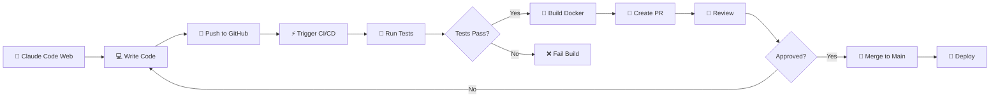

# 🚀 Claude Code Web + GitHub CI/CD Demo

A complete demonstration of using **Claude Code Web Version** (accessible from mobile devices) with GitHub Actions for automated CI/CD pipelines.

## 📱 Overview

This project showcases how to:
- Write code using Claude Code web version from your **phone or tablet**
- Push changes to GitHub in feature branches
- Automatically trigger **Docker builds**
- Run **automated tests**
- Create **Pull Requests automatically**
- Deploy to production when tests pass

## 🎯 The Complete Workflow



## 🌟 Key Features

### 1. Mobile-First Development
- Access Claude Code from any device with a web browser
- Write production code from your phone
- No local development environment needed

### 2. Automated CI/CD Pipeline
- **Continuous Integration**: Automated tests on every push
- **Docker Containerization**: Consistent deployment environments
- **Automated PR Creation**: Feature branches automatically create PRs
- **Continuous Deployment**: Automatic deployment on main branch merge

### 3. Quality Assurance
- Unit tests run automatically
- Docker health checks
- Build verification before deployment

## 📋 Prerequisites

- GitHub account
- Claude Code Web access
- GitHub repository with Actions enabled

## 🚀 Getting Started

### Step 1: Setup Repository

1. Fork or create this repository
2. Enable GitHub Actions in repository settings
3. Ensure branch protection rules are configured for `main` branch

### Step 2: Using Claude Code Web (From Your Phone!)

1. **Access Claude Code Web**
   - Open your mobile browser
   - Navigate to Claude Code web interface
   - Authenticate with your account

2. **Connect to GitHub**
   ```
   Tell Claude: "Clone my repository [repository-url]"
   ```

3. **Make Changes**
   ```
   Tell Claude: "Add a new feature to display user statistics"
   ```

4. **Push to Feature Branch**
   ```
   Tell Claude: "Push these changes to a new feature branch"
   ```

   Claude will automatically:
   - Create a branch with naming convention: `claude/feature-name-sessionid`
   - Commit your changes
   - Push to GitHub

### Step 3: Automated CI/CD Pipeline

Once you push to a `claude/*` branch, GitHub Actions automatically:

#### 🔨 Build Phase
```yaml
- Checkout code
- Install Node.js dependencies
- Run automated tests
- Generate test reports
```

#### 🐳 Docker Phase
```yaml
- Build Docker image
- Run container health checks
- Save image as artifact
```

#### 📝 PR Phase (Automatic)
```yaml
- Create Pull Request to main
- Add CI/CD status badges
- Label with 'automated-pr' and 'claude-code'
```

### Step 4: Review and Merge

1. **Review the automated PR**
   - Check test results
   - Review code changes
   - Verify Docker build succeeded

2. **Merge when ready**
   - Click "Merge Pull Request"
   - Automatic deployment triggers

3. **Deployment**
   - Application deploys to production
   - Health checks verify deployment
   - Notification sent

## 🏗️ Project Structure

```
.
├── .github/
│   └── workflows/
│       └── ci-cd.yml          # GitHub Actions workflow
├── index.html                  # Main web page
├── server.js                   # Express server
├── test.js                     # Test suite
├── package.json                # Node.js dependencies
├── Dockerfile                  # Docker configuration
├── .dockerignore              # Docker ignore rules
├── .gitignore                 # Git ignore rules
└── README.md                  # This file
```

## 🔧 Configuration

### GitHub Actions Workflow

The `.github/workflows/ci-cd.yml` file defines:

```yaml
# Triggers
on:
  push:
    branches:
      - 'claude/**'  # All Claude feature branches
      - main
  pull_request:
    branches:
      - main

# Jobs
jobs:
  build-and-test:    # Run tests
  build-docker:      # Build container
  create-pr:         # Auto-create PR
  deploy:            # Deploy to production
```

### Environment Variables

Configure in GitHub repository settings under "Secrets and variables":

```
DOCKER_REGISTRY_URL    # Your Docker registry
DEPLOY_TOKEN          # Deployment token
SLACK_WEBHOOK         # Notifications (optional)
```

## 🧪 Testing

### Run Tests Locally

```bash
# Install dependencies
npm install

# Run tests
npm test

# Expected output:
# ✅ PASS: Health check endpoint returns 200
# ✅ PASS: Health check returns valid JSON
# ✅ PASS: API info endpoint returns 200
# ✅ PASS: API info returns valid structure
# ✅ PASS: Main page returns 200
```

### Run Docker Locally

```bash
# Build Docker image
docker build -t claude-cicd-demo .

# Run container
docker run -p 3000:3000 claude-cicd-demo

# Test health endpoint
curl http://localhost:3000/health

# Test application
open http://localhost:3000
```

## 📱 Mobile Workflow Example

Here's a real example of using Claude Code Web from your phone:

### Scenario: Add a New Feature

**You (via phone):**
> "Claude, I want to add a new section to the homepage that shows the current build number and deployment time"

**Claude responds:**
> "I'll add that feature for you. Let me update the index.html file..."

**You:**
> "Great! Now push this to GitHub"

**Claude responds:**
> "I'll commit these changes and push to a new feature branch..."
>
> ✅ Created branch: `claude/add-build-info-a1b2c3d4`
> ✅ Committed changes
> ✅ Pushed to GitHub
>
> The CI/CD pipeline is now running. You can monitor it at:
> https://github.com/your-username/repo/actions

### What Happens Next (Automatically)

1. **Within 30 seconds**: Tests start running
2. **Within 2 minutes**: Docker build completes
3. **Within 3 minutes**: PR is automatically created
4. **You receive**: GitHub notification on your phone
5. **You review**: PR from your phone browser
6. **You approve**: Tap "Merge Pull Request"
7. **Within 5 minutes**: Feature is live in production!

## 🎓 Use Cases

### 1. Quick Bug Fixes
Fix production issues from anywhere, anytime
```
"Claude, the health check endpoint is returning 404, can you fix it?"
```

### 2. Feature Development
Build new features without opening a laptop
```
"Claude, add a dark mode toggle to the website"
```

### 3. Code Reviews
Review and improve code quality
```
"Claude, refactor the server.js file to use async/await"
```

### 4. Documentation
Keep documentation up to date
```
"Claude, update the README with the new API endpoints"
```

## 🔐 Security Best Practices

1. **Branch Protection**
   - Require PR reviews before merging to main
   - Require status checks to pass
   - Restrict who can push to main

2. **Secrets Management**
   - Never commit secrets to repository
   - Use GitHub Secrets for sensitive data
   - Rotate credentials regularly

3. **Docker Security**
   - Use official base images
   - Scan images for vulnerabilities
   - Implement least privilege principle

## 🐛 Troubleshooting

### Tests Failing

```bash
# Check test output in GitHub Actions
# View logs in Actions tab

# Run locally to debug
npm install
npm test
```

### Docker Build Failing

```bash
# Check Dockerfile syntax
docker build -t test .

# View build logs
docker build --progress=plain -t test .
```

### PR Not Created Automatically

Check:
- Branch name starts with `claude/`
- GitHub Actions is enabled
- Repository has PR write permissions

## 📊 Monitoring

### Build Status

Check the GitHub Actions tab for:
- Build duration
- Test results
- Docker build logs
- Deployment status

### Health Monitoring

```bash
# Check application health
curl https://your-app-url.com/health

# Check API status
curl https://your-app-url.com/api/info
```

## 🚀 Deployment Options

This setup can deploy to:

- **Cloud Platforms**: AWS, GCP, Azure
- **Container Orchestration**: Kubernetes, Docker Swarm
- **PaaS**: Heroku, Render, Railway
- **Serverless**: AWS Lambda, Google Cloud Functions
- **Edge**: Cloudflare Workers, Vercel

To configure deployment, update the `deploy` job in `.github/workflows/ci-cd.yml`

## 🤝 Contributing

This is a demo project, but contributions are welcome!

1. Use Claude Code Web to make changes
2. Push to a feature branch
3. Wait for automated PR creation
4. Review and merge

## 📝 License

MIT License - feel free to use this for your own projects!

## 🎉 Success Metrics

With this setup, you can:
- ✅ Write code from your phone
- ✅ Deploy to production in under 5 minutes
- ✅ Automatically run tests on every change
- ✅ Ensure code quality with automated checks
- ✅ Work from anywhere, anytime

## 🔗 Resources

- [GitHub Actions Documentation](https://docs.github.com/en/actions)
- [Docker Documentation](https://docs.docker.com/)
- [Claude Code Documentation](https://docs.anthropic.com/claude/docs)
- [Express.js Documentation](https://expressjs.com/)

## 💡 Tips for Mobile Development

1. **Use Voice Input**: Most mobile browsers support voice-to-text
2. **Bookmark Repository**: Quick access to your GitHub repo
3. **Enable Notifications**: Stay updated on PR status
4. **Use Split Screen**: View docs while coding with Claude
5. **Test on Device**: Mobile-first approach ensures compatibility

## 🎯 Next Steps

1. **Customize the Pipeline**: Add more tests, linting, security scans
2. **Add Monitoring**: Integrate with monitoring services
3. **Implement Staging**: Add a staging environment
4. **Add Notifications**: Slack, Discord, or email notifications
5. **Scale Up**: Add load balancing and auto-scaling

---

**Happy coding from your phone! 📱 + 🚀 = 💯**

Built with ❤️ using Claude Code Web
